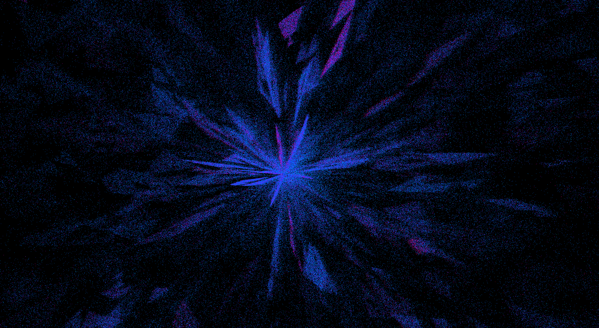
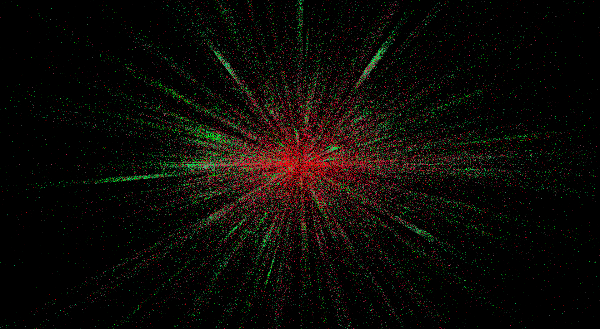

# gaia-resources

This is a collection of the Gaia Releases Universe Model data uploaded by the European Space Agency, converted in a more efficient binary format using the [`gaia-archive-tools`](https://github.com/mrsinho/gaia-archive-tools) library.

> [About the gaia mission](https://www.esa.int/Science_Exploration/Space_Science/Gaia)

---

## Supported releases

| ESA original data release | _gaia-resources release_ |
|---|---|
|[`Gaia Early Data Release 3`](https://www.cosmos.esa.int/web/gaia/early-data-release-3) | [_`GEDR3-v1.0.0-alpha`_](https://github.com/MrSinho/gaia-resources/releases/tag/v1.0.0-alpha) |

---